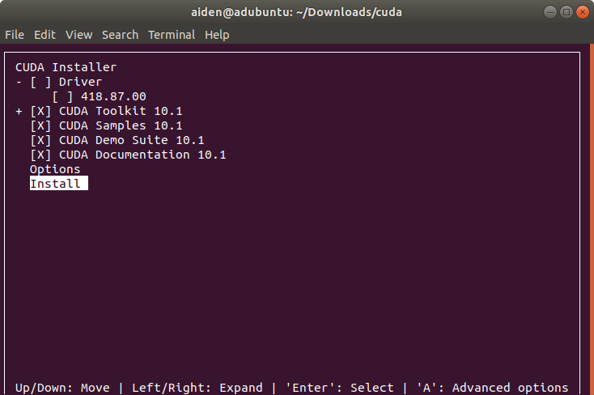
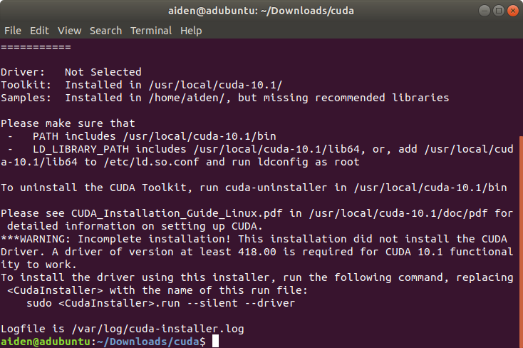

# Install Cuda

我这里显卡是Nvidia 2060， 准备安装Cuda 10.1 + Cudnn 7.6.5


## Option 1: Use Conda

感觉是最简单的方式了。特别是之前Tensorflow 只支持cuda 10.0， Pytorch支持cuda 10.1。

```
conda install cudatoolkit=10.1 cudnn=7.6.5
```
提是如下：
```
## Package Plan ##

  environment location: /home/aiden/.conda/envs/tf2

  added / updated specs:
    - cudatoolkit=10.1
    - cudnn=7.6.5


The following NEW packages will be INSTALLED:

  cudatoolkit        anaconda/pkgs/main/linux-64::cudatoolkit-10.1.243-h6bb024c_0
  cudnn              anaconda/pkgs/main/linux-64::cudnn-7.6.5-cuda10.1_0

```

然后按Y 开始安装。


## Option 2: Download from Nvidia

1. 安装cuda
```bash
sudo sh cuda_10.1.243_418.87.00_linux.run
```

因为驱动已经按照了更新的版本，所以这里取消勾选Driver



安装完成后



2. 安装Cudnn

下载的是cudnn-10.1-linux-x64-v7.6.5.32.solitairetheme8.tgz

然后解压并复制到 /usr/local/cuda下

```
tar -xzvf cudnn-10.1-linux-x64-v7.6.5.32.solitairetheme8.tgz

sudo cp cuda/include/cudnn.h /usr/local/cuda/include/ 
sudo cp cuda/lib64/libcudnn* /usr/local/cuda/lib64/ 
sudo chmod a+r /usr/local/cuda/include/cudnn.h
```
修改~/.bashrc，添加如下内容

```bash
export CUDA_HOME=/usr/local/cuda-10.1

export PATH=$CUDA_HOME/bin:$PATH   

export LD_LIBRARY_PATH=$CUDA_HOME/lib64:$CUDA_HOME/extras/CUPTI/lib64:$LD_LIBRARY_PATH
```

## Option 3: Use apt install

参考Tensorflow 官网的安装， 本人未验证。

Ubuntu 18.04 (CUDA 10.1)
```bash
# Add NVIDIA package repositories
wget https://developer.download.nvidia.com/compute/cuda/repos/ubuntu1804/x86_64/cuda-repo-ubuntu1804_10.1.243-1_amd64.deb
sudo dpkg -i cuda-repo-ubuntu1804_10.1.243-1_amd64.deb
sudo apt-key adv --fetch-keys https://developer.download.nvidia.com/compute/cuda/repos/ubuntu1804/x86_64/7fa2af80.pub
sudo apt-get update
wget http://developer.download.nvidia.com/compute/machine-learning/repos/ubuntu1804/x86_64/nvidia-machine-learning-repo-ubuntu1804_1.0.0-1_amd64.deb
sudo apt install ./nvidia-machine-learning-repo-ubuntu1804_1.0.0-1_amd64.deb
sudo apt-get update

# Install NVIDIA driver
sudo apt-get install --no-install-recommends nvidia-driver-418
# Reboot. Check that GPUs are visible using the command: nvidia-smi

# Install development and runtime libraries (~4GB)
sudo apt-get install --no-install-recommends \
    cuda-10-1 \
    libcudnn7=7.6.4.38-1+cuda10.1  \
    libcudnn7-dev=7.6.4.38-1+cuda10.1


# Install TensorRT. Requires that libcudnn7 is installed above.
sudo apt-get install -y --no-install-recommends libnvinfer6=6.0.1-1+cuda10.1 \
    libnvinfer-dev=6.0.1-1+cuda10.1

```


## Test

测试，cuda版本查询
```
nvcc --V
```
