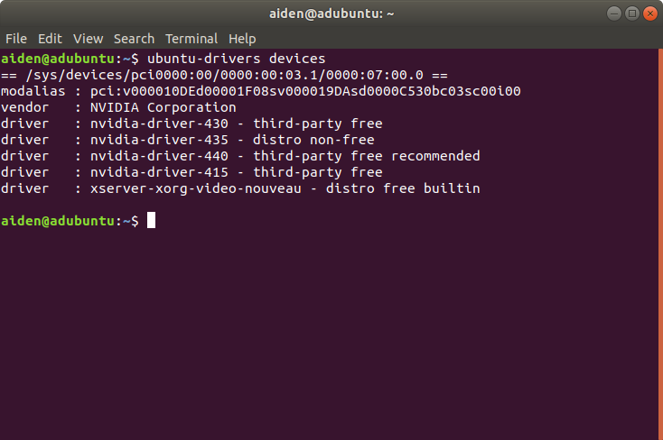
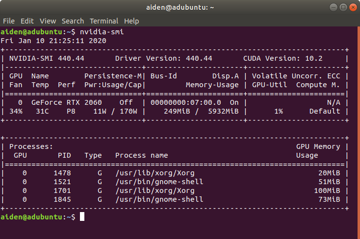

# Install Nvidia Driver

## Blacklist nouveau

/etc/modprobe.d中创建文件blacklist-nouveau.conf

```bash
sudo vi /etc/modprobe.d/blacklist-nouveau.conf
```

在文件中输入一下内容：
```
blacklist nouveau
options nouveau modeset=0
```

执行：
```bash
sudo update-initramfs –u
```

重启

再执行:
```bash
lsmod | grep nouveau
```
若无内容输出，则禁用成功。


## Install Driver

Add PPA repo
```bash
sudo add-apt-repository ppa:graphics-drivers
sudo apt-get update
```

Run 'ubuntu-drivers devices' to check available drivers



Automatically install recommemded drivers

```bash
sudo ubuntu-drivers autoinstall
```

Reboot

## Check

Run nvidia-smi to check the installation.


