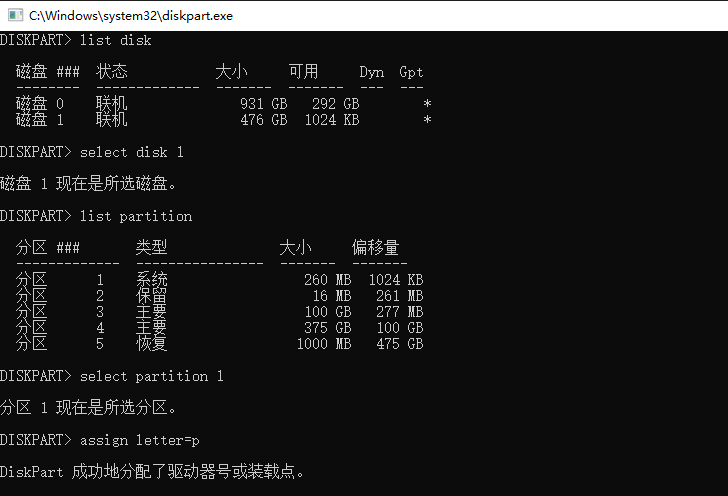
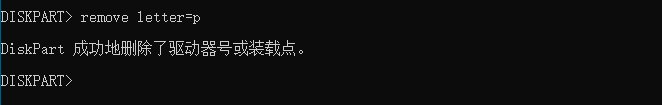

# Uninstall Ubuntu

如果需要卸载Ubuntu，并且恢复Windows 启动项。 前提是做好相关备份。

## Delete Partition

登录Windows， 使用自带的磁盘管理软件，删除Ubuntu磁盘分区。

## Remove GRUB

打开CMD， 输入diskpart，如何找到对应的磁盘和EFI分区，然后分配盘符P

然后使用管理员打开Notepad， 菜单打开， 选择打开P 盘。 删除里面的ubuntu文件夹即可。

完成后再去掉盘符P

