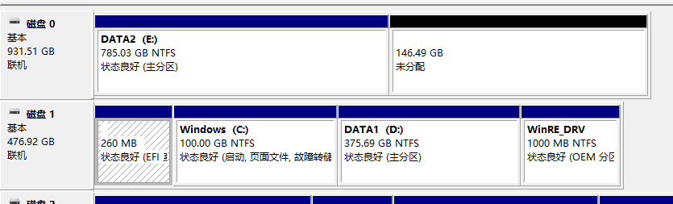
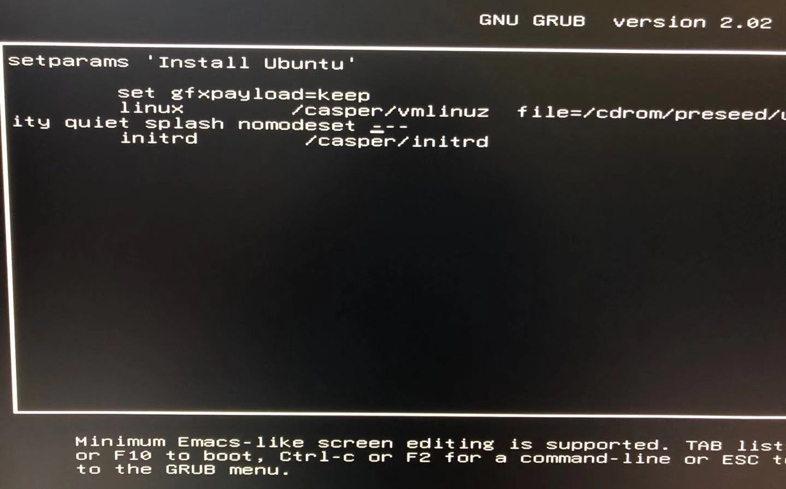
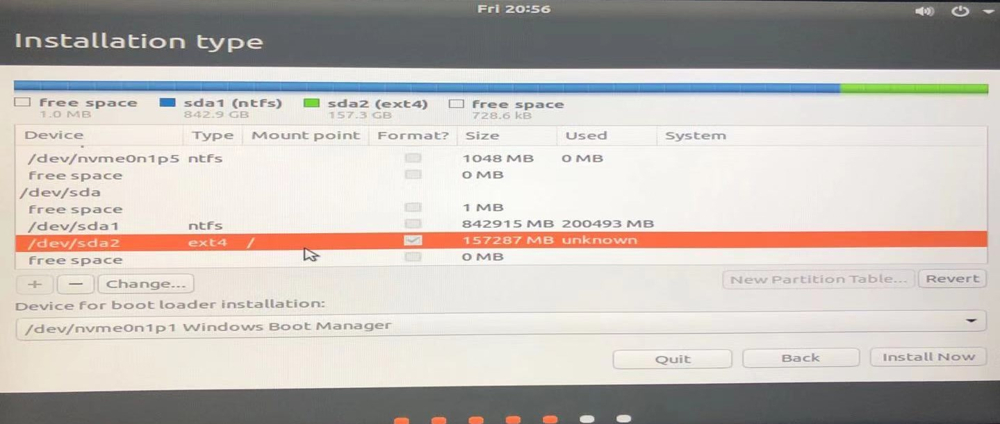

# Install Ubuntu (18.04)

安装Ubuntu 18.04 和 Windows 10双系统

## 准备USB启动盘

下载iso: ubuntu-18.04.3-desktop-amd64.iso

使用Rufus 写入u盘

## 准备磁盘

使用windows 自带的磁盘管理，压缩出一个未使用的分区。

这里准备了150G的磁盘空间。

## 安装

进BIOS Disable Security Boot (参考网上教程)

断开网络进行安装，否则会很慢。

开机按F12， 选择使用U盘启动。 选择第二项Install Ubuntu，按e键进入grub启动参数编辑，移动光标到倒数第二行linux ...splash，加上nomodeset，然后按F10 开始安装Ubuntu系统。

安装过程中，最重要的是分区这一步， 这里其实只需要设置一个/分区即可， 也可以多加个/home分区。不需要创建 /boot，不需要额外创建efi分区，不需要创建swap（台式机，内存够大，系统自动分配2G）

Device for boot loader就选择Windows Boot Manager

然后开始安装。完成后重启， 进入系统的时候， 同样需要编辑grub补上nomodeset，才能正常登录系统。
