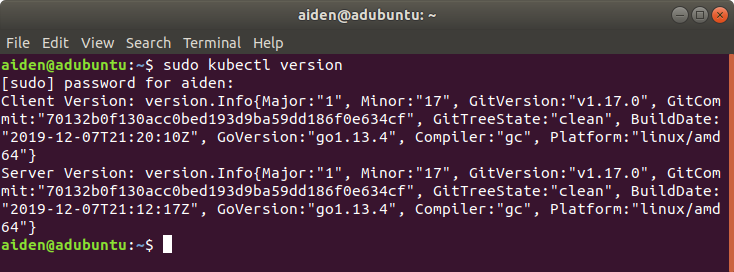
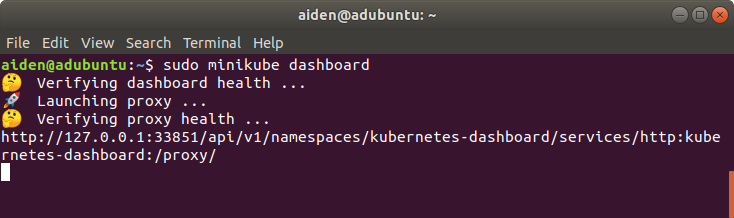

# Install minikube

## Download minikube

Current version of minikube is v1.6.2
```bash
sudo curl -Lo minikube https://storage.googleapis.com/minikube/releases/latest/minikube-linux-amd64
sudo chmod +x minikube
sudo mv minikube /usr/local/bin/
```

## Download kubectl

Current version of kubectl is 1.17.0
```bash
curl -LO https://storage.googleapis.com/kubernetes-release/release/$(curl -s https://storage.googleapis.com/kubernetes-release/release/stable.txt)/bin/linux/amd64/kubectl
chmod +x kubectl
sudo mv kubectl /usr/local/bin/kubectl
```


## Start minikube

> Note: Make sure Docker is installed and create a mirror service from aliyun first

Start minikube using `--vm-driver=none`
```bash
sudo minikube start --image-mirror-country cn \
	--vm-driver=none \
    --registry-mirror=https://xxx.mirror.aliyuncs.com
```

It will take some time, Wait until you see
```
...
Done! kubectl is now configured to use "minikube"
```

## Check

Run `sudo kubectl version`




Run `sudo minikube dashboard`



> Note: The firewall needs to be disabled to access the dashboard. Run `sudo ufw disable`


## Stop minikube

To stop minikube, run:
```bash
sudo minikube stop
```
