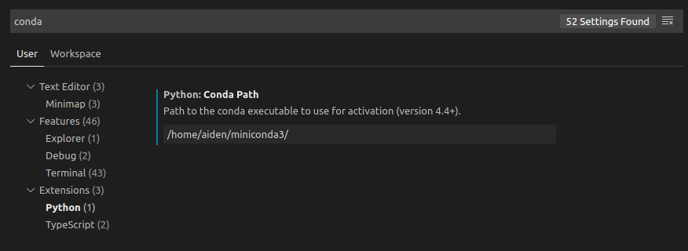

# Python Environment

## Conda

这里使用的是Miniconda， 这个没什么好说的。
安装完后修改权限
```
sudo chown 1000:1000 ~/.conda
```
然后配置conda 国内源：

```bash
vi ~/.condarc
```
内容如下：
```
auto_activate_base: false
channels:
  - https://mirrors.ustc.edu.cn/anaconda/pkgs/main/
  - https://mirrors.tuna.tsinghua.edu.cn/anaconda/cloud/conda-forge
  - https://mirrors.tuna.tsinghua.edu.cn/anaconda/pkgs/free/
  - https://mirrors.tuna.tsinghua.edu.cn/anaconda/cloud/msys2/
  - defaults
show_channel_urls: true
```

## PIP

配置PIP 国内源, 执行如下命令：

```bash
mkdir ～/.pip

vi ～/.pip/pip.conf
```
内容如下（阿里源）：
```
[global]
index-url = http://mirrors.aliyun.com/pypi/simple/

[install]
trusted-host=mirrors.aliyun.com
```
或者使用清华源
```
[global]
index-url = https://pypi.tuna.tsinghua.edu.cn/simple

[install]
trusted-host = https://pypi.tuna.tsinghua.edu.cn
```


## Tensorflow

配置Tensorflow 环境， 这里安装的是当前最新版本Tensorflow r2.1 Stable
```
conda create -n tf2 python=3.7

conda activate tf2

pip install tensorflow-gpu
```

## Pytorch

To be updated.


## Other Libraries

安装其他库：
```
conda install scipy scikit-learn scikit-image matplotlib pandas seaborn

pip install xgboost
```

## VSCode

安装Code及 Python 插件

配置Conda路径




## Test

新建 python文件， 测试Tensorflow GPU安装
```python
import tensorflow as tf

a = tf.constant(1.)
b = tf.constant(2.)
print(a+b)

print('GPU:', tf.config.list_physical_devices('GPU'))
```
执行结果如下：
```
...
tf.Tensor(3.0, shape=(), dtype=float32)
GPU: [PhysicalDevice(name='/physical_device:GPU:0', device_type='GPU')]
```

